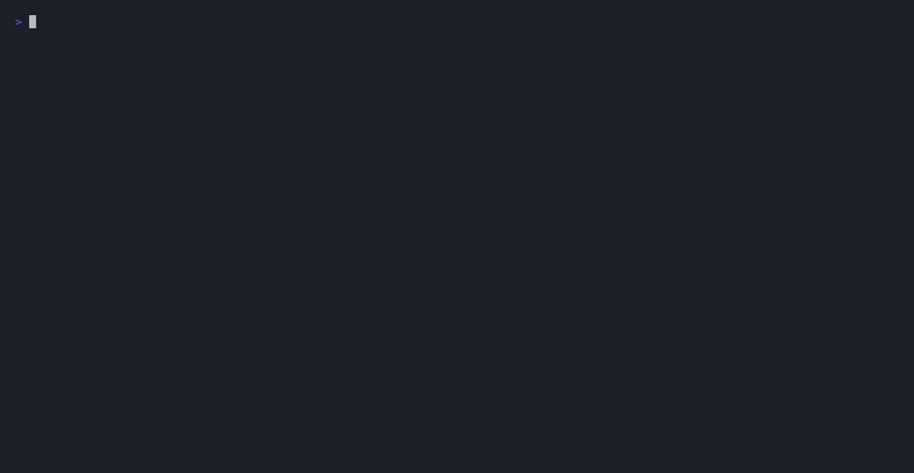

# Gavel

[](https://github.com/gavelcode/gavel/actions/workflows/ci.yml)
[](https://codecov.io/gh/gavelcode/gavel)
[](LICENSE)


**Bazel builds your monorepo. Gavel judges it. Order in the codebase!**

The quality gate for Bazel monorepos — build-graph-native, local, agent-ready.

Your monorepo builds green. That's not the same as innocent. Gavel gathers the
evidence as Bazel aspects, holds every change to the law you set in `gavel.yaml`,
and returns a verdict: the regression you just introduced stands charged, while a
decade of existing debt is not on trial. One verdict, handed to your CI, your
terminal, and your coding agent alike.

```bash
gavel init      # open the case
gavel judge     # hear it
```



---

## Install

```sh
# Homebrew — macOS & Linux
brew install gavelcode/tap/gavel

# or the install script — Linux, CI, Docker
curl -fsSL https://raw.githubusercontent.com/gavelcode/gavel/main/install.sh | sh
```

Prebuilt binaries for every platform are on the [releases page](https://github.com/gavelcode/gavel/releases).
Gavel needs a Bazel **8.0+** (bzlmod) workspace; verify with `gavel --version`.

<details>
<summary>Build from source</summary>

```sh
bazel build //apps/cli/cmd/gavel
# binary at bazel-bin/apps/cli/cmd/gavel/gavel_/gavel
```

</details>

## How it works

*Every change gets its day in court.*

### 1. The evidence comes from the build graph

Analyzers — golangci-lint, PMD, CPD, SpotBugs, Error Prone, Ruff, Bandit,
ESLint, Clippy — run as Bazel **aspects**. They see the exact source tree,
dependency graph, and toolchains Bazel already resolves; no separate scanner, no
second config to drift. SonarQube re-scans the world; Gavel looks only at the
targets the graph says changed (`--affected`), so a run stays fast as the
monorepo grows. Every tool, every language, normalized to one format: **SARIF**.

### 2. You're only tried for what you changed

`gavel.yaml` **is** the quality gate — code, reviewed and versioned with the
repo, not clicked into a web UI. It evaluates only what you just added against a
committed baseline: new findings, coverage regressions, new architecture
violations. Adopt Gavel on ten years of debt and it blocks on today's diff,
never on the backlog.

```yaml
projects:
  - name: payments
    pattern: "//payments/..."
    tooling:
      go: [golangci-lint, archtest]
    quality_gate:
      findings: { max_error: 0 }
      coverage: { min: 80 }
      architecture_violations: { max: 0 }
```

Every run saves a fingerprint snapshot; the next shows the delta — new, fixed,
existing — plus the coverage trend. No server required.

```
  payments/api/handler.go:42  error  null check missing  golangci-lint:nilerr  NEW

  ⚖  VERDICT: FAIL — code_quality
     1 new · 8 fixed · 31 existing        coverage 73.5% (↑5.0%)        architecture PASS
```

### 3. A verdict your coding agent can request

Coding agents write code they can't see the consequences of — a lint regression,
a coverage drop, a layering violation land three commits later in CI. `gavel mcp`
starts a [Model Context Protocol](https://modelcontextprotocol.io) server that
exposes `judge`, `lint_file`, `findings`, `coverage`, and `arch` as tools. Point
Claude Code, Cursor, or Zed at it and the agent checks its own work against the
same Bazel-aware gate **as it writes** — a quality conscience, inline.

For editors and dashboards, `gavel watch` re-analyzes on every save and emits a
JSONL event stream. Both run fully local — no server, no network.

## Gavel vs SonarQube: the case

| | SonarQube | Gavel |
|---|---|---|
| Build-graph awareness | None | Bazel aspects understand target dependencies |
| Monorepo model | One project, or a branch per project | Hierarchical: per-package, per-project, whole repo |
| Analysis scope | Full scan or file diff | Bazel-aware: changed files + affected targets |
| Local workflow | Server round-trip | Fully local, zero network |
| Coding-agent / editor loop | — | MCP server + `watch` event stream |
| Quality gate | Web-UI config | Code (`gavel.yaml`), versioned with the repo |
| Progress tracking | Server-backed | Local fingerprint snapshots, no infrastructure |
| Footprint | Java server + database + scanner | One static Go binary, runs inside Bazel |

SonarQube is a mature platform with fifteen years of rules behind it, and Gavel
isn't trying to replace it. Gavel answers a question SonarQube structurally
can't: *which packages of my Bazel monorepo are healthy, and did this change
make one of them worse* — where the build graph is the unit of analysis and the
inner loop is where quality is actually won.

> **Already running [aspect's rules_lint](https://github.com/aspect-build/rules_lint)?**
> Keep it. Gavel reads the SARIF it drops in `bazel-bin/`
> (`gavel judge --findings-source=rules_lint`) and turns those reports into a
> gate — baseline delta, coverage, architecture, verdict — the layer rules_lint
> deliberately leaves to you.

## Status

> **Alpha — v0.1.0.** Under active development; APIs and config formats may change.
> Gavel gates its own repository on every commit — it is its own first user.

Working today:

- `gavel init` — scaffold config + Bazel integration
- `gavel judge` — analyze, evaluate the gate, show findings and the delta
- `gavel judge --project <name>` · `--quick` · `--summary` · `--affected` — scope and shape the run
- `gavel judge --absolute` — evaluate all findings (release gates, nightly)
- `gavel judge --json` · `--output-sarif report.sarif` — structured output for CI, IDEs, GitHub Code Scanning
- `gavel judge --server URL --token TOKEN` — shared team baseline: fetch and submit
- `gavel watch` — re-analyze on change, emitting a JSONL event stream
- `gavel mcp` — Model Context Protocol server for editor / agent integration
- `gavel validate` — check Bazel integration health
- Baseline mode (default): fingerprint-based new/fixed/existing classification, committed to git for the team
- Analyzers: golangci-lint, PMD, CPD, SpotBugs, Error Prone, Ruff, Bandit, ESLint, Clippy
- Server (optional): web dashboard, centralized history, team baselines, API-token auth

## Documentation

- [Quickstart](docs/quickstart.md) — from zero to a first verdict in five minutes
- [Configuration](docs/configuration.md) — `gavel.yaml` and `architecture.yml`, field by field
- [Baseline & delta](docs/baseline.md) — how new / fixed / existing is decided
- [Server deployment](docs/deployment.md) — running `gavel-server`
- [Full documentation index](docs/index.md)

## Contributing

Issues and pull requests are welcome — see [CONTRIBUTING.md](CONTRIBUTING.md) and
our [Code of Conduct](CODE_OF_CONDUCT.md). Security reports go through
[SECURITY.md](SECURITY.md).

## License

[Apache License 2.0](LICENSE)
